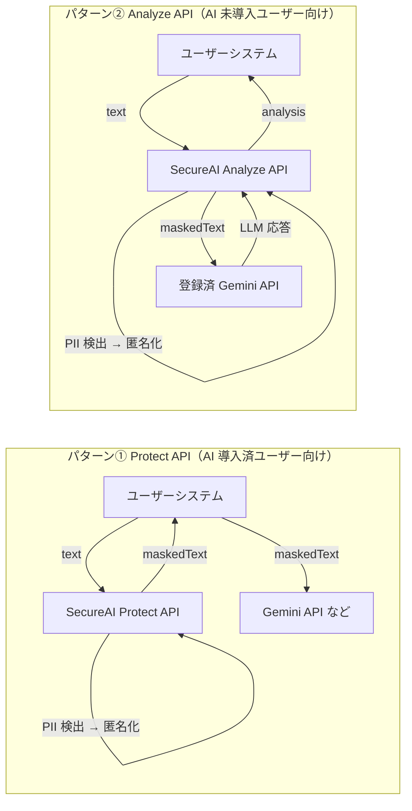

# SecureAI Studio

> **AI を安全に利用するための共通セキュリティレイヤー（AI Security Platform）**

SecureAI Studio は、Gemini・Claude・OpenAI などの LLM へデータを送信する **前** に、
PII（個人情報）を自動で検出・匿名化するためのプラットフォームです。
開発者は既存システムに数行のコードを追加するだけで、安全に AI を利用できるようになります。

**ミッション:「AI を使う前に SecureAI を通す」を世界標準にする。**

> [!IMPORTANT]
> 本リポジトリは現在 **設計フェーズ（承認待ち）** です。
> 実装は、設計ドキュメントの確認・承認後に開始します。
> 設計一式は [`docs/architecture/`](./docs/architecture/) を参照してください。

---

## 提供する 2 つの API パターン

- **Protect API** — マスク済みテキストを返す。LLM への送信はユーザー側で行う。
- **Analyze API** — マスク → 登録済みプロバイダーへ送信 → 分析結果を返す。

## 技術スタック（概要）

| レイヤー | 採用技術 |
| --- | --- |
| Frontend | Next.js (App Router) / TypeScript / Tailwind CSS / shadcn/ui |
| Backend | FastAPI (Python) |
| Database | Supabase (PostgreSQL) |
| Auth | Supabase Auth |
| PII 保護 | Microsoft Presidio / GiNZA / Regex |
| AI | Gemini API（MVP）／ Claude・OpenAI・DeepSeek・Grok・Local（将来） |

詳細は [ライブラリ構成](./docs/architecture/10-library-stack.md) を参照。

## ドキュメント

設計一式は [`docs/architecture/README.md`](./docs/architecture/README.md) にインデックスがあります。
