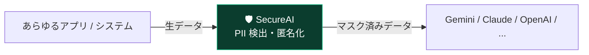
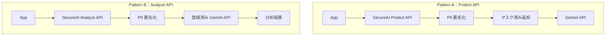

# SecureAI Studio

> **AI Security Platform** — AI を「作る」サービスではなく、**AI を安全に「使う」ための共通セキュリティレイヤー**です。

SecureAI Studio は、Gemini・Claude・OpenAI などの LLM へデータを送信する **前** に、
PII（個人情報）を自動で検出・匿名化する **共通レイヤー** を提供します。
開発者は既存システムに数行のコードを追加するだけで、安全に AI を利用できます。

> [!IMPORTANT]
> ### 中核思想：**「AI へ送る前に、必ず SecureAI を通す」**
> 本プロダクトの最大の価値は「Gemini を提供すること」では **ありません**。
> **AI へデータを送る前に PII を保護する “共通レイヤー”** であることが本質です。
> この思想は [PRD](./docs/PRD.md)・[Architecture](./docs/architecture/)・README のすべてに一貫して反映されています。

## これは何か / 何ではないか

| SecureAI Studio は… | ✅ そうである | ❌ そうではない |
| --- | --- | --- |
| 位置付け | AI Security Platform（共通 PII 保護レイヤー） | AI（LLM）を提供するサービス |
| 役割 | AI へ送る前の「関所」／ゲートウェイ | AI そのもの・モデル提供者 |
| 価値 | どの AI を使っても PII を守れる横断的な安全層 | 特定プロバイダー（Gemini 等）への依存 |



---

## 2 つの利用パターン

### Pattern A — Protect API（すでに Gemini API 等を利用中の開発者向け）

自社で LLM を呼んでいる開発者が、送信前にマスクだけを SecureAI に任せるパターン。

```text
App
  ↓
SecureAI Protect API
  ↓
PII 匿名化
  ↓
マスク済みデータ返却
  ↓
Gemini API（開発者が自分で送信）
```

### Pattern B — Analyze API（まだ AI を導入していない開発者向け）

LLM 未導入の開発者が、マスク〜LLM 呼び出し〜結果取得までを SecureAI 経由で行うパターン。

```text
App
  ↓
SecureAI Analyze API
  ↓
PII 匿名化
  ↓
登録済み Gemini API（SecureAI が呼び出し）
  ↓
分析結果
```



---

## SecureAI Studio（管理画面）の役割

Studio は Google AI Studio ライクな **管理コンソール**です。最低限、以下を管理します。

| 管理対象 | 内容 |
| --- | --- |
| **Project** | 利用単位。設定・キー・ルール・ログはすべてプロジェクトに紐づく |
| **Provider** | LLM プロバイダー（Gemini／将来 Claude・OpenAI 等）の登録 |
| **Provider API Keys** | プロバイダー側の API キー（**AES-256-GCM 暗号化**・ローテーション） |
| **Protect Rules** | PII 保護ルール（**DB 管理**・ON/OFF・カスタム/Regex 追加可能） |
| **API Keys** | SecureAI 発行キー（**Protect 用 / Analyze 用を分離**・ローテーション） |
| **Analytics** | 利用数・Protect 件数・種別内訳・Token 数・Provider 利用率・応答時間 |
| **Logs** | リクエストログ（メタデータのみ・生 PII は保存しない） |
| **Settings** | プロフィール・組織・メンバー・プラン |

## 差別化・特徴

- 🧪 **Protect Playground** — 貼り付け → ルール ON/OFF → 保護実行 → どこが `[PERSON]`/`[PHONE]` に置換されたかをリアルタイムプレビュー → そのまま「Gemini で分析」。導入前の検証・デモに最適（[設計](./docs/architecture/15-protect-playground.md)）。
- 🔌 **Provider Interface** — Gemini から着手し、Claude/OpenAI/DeepSeek/Grok/Local を同一 IF で追加（[設計](./docs/architecture/11-provider-interface.md)）。
- 🧩 **Plugin 構造** — MCP・Webhook・Streaming・Batch・PDF/Word/Excel・OCR・Image・Audio・RAG を後付け可能（[設計](./docs/architecture/14-plugin-architecture.md)）。
- 📦 **SDK 前提の API** — REST に加え JS / Python / Node SDK を提供予定（[設計](./docs/architecture/12-sdk-design.md)）。
- 📤 **Export Module** — Studio から Claude Code / Codex / Cursor / Windsurf 向けプロンプトを自動生成（[設計](./docs/architecture/13-export-module.md)）。
- 🔐 **DB 管理の Protect Rules** — 固定 12 項目ではなく、企業独自ルール・Regex を自由に追加。

## 技術スタック（概要）

| レイヤー | 採用技術 |
| --- | --- |
| Frontend | Next.js (App Router) / TypeScript / Tailwind CSS / shadcn/ui |
| Backend | FastAPI (Python) |
| Database | Supabase (PostgreSQL) |
| Auth | Supabase Auth |
| PII 保護 | Microsoft Presidio / GiNZA / Regex |
| AI | Gemini API（MVP）／ Claude・OpenAI・DeepSeek・Grok・Local（将来） |

## 実装状況

設計承認後、MVP を段階的に実装中です。

| 領域 | 状態 |
| --- | --- |
| API: Protect / Analyze / Detect（FastAPI・Clean Architecture） | ✅ 実装・**テスト済** |
| PII エンジン（Regex + Luhn/マイナンバー/法人番号検証・12種） | ✅ |
| Provider Interface（echo / gemini）・フェイルクローズ | ✅ |
| API キー（Protect/Analyze 分離・ローテーション・認可） | ✅ |
| **Postgres 永続化 + 管理 API（JWT・テナント分離）** | ✅ 実 PG で統合テスト |
| DB マイグレーション + seed（Supabase・RLS） | ✅ 実 PostgreSQL 16 に適用・検証済 |
| **Web: Dashboard（Projects/API Keys/Protect Rules/Providers）** | ✅ 管理 BFF 経由 |
| Web: ランディング + **Protect Playground** | ✅ BFF でキー秘匿 |
| **Plugin 基盤 + Extract / Batch / Streaming / Webhook** | ✅ 実装・テスト済 |
| **SDK（Python `secureai` / JS `@secureai/sdk`）** | ✅ Python テスト済・JS 型検証/ビルド通過 |
| **Export Module（Claude Code/Codex/Cursor/Windsurf）** | ✅ 実装・テスト済 |
| **マルチプロバイダー（Gemini / Claude / OpenAI）** | ✅ アダプタ実装・テスト済（DeepSeek/Grok/Local は OpenAI 互換で拡張可） |
| **Plugin: PDF / Word / Excel 抽出** | ✅ optional deps（`.[extractors]`）で有効化・テスト済 |
| **Analytics 可視化（Dashboard）** | ✅ 統計タイル・種別内訳バー・ログ表示 |
| Plugin: OCR / Audio / RAG / MCP | 🧩 宣言済（stub・optional 実装） |
| 本番 Supabase Auth 結線 / RS256 JWKS | ⏳ 今後 |

テスト: **backend pytest 45件緑**（うち 4 件は実 Postgres 統合）＋ **Python SDK 5件**／`next build`・SDK `tsc` 通過。
実行方法は [開発ガイド](./docs/DEVELOPMENT.md) を参照。

## ドキュメント

- 📘 [PRD（プロダクト要求仕様）](./docs/PRD.md) — 思想・位置付け・価値・スコープ
- 🏛 [設計ドキュメント一式](./docs/architecture/README.md) — アーキテクチャ〜セキュリティ〜Playground
- 🛠 [開発ガイド](./docs/DEVELOPMENT.md) — セットアップ・実行・実装状況
