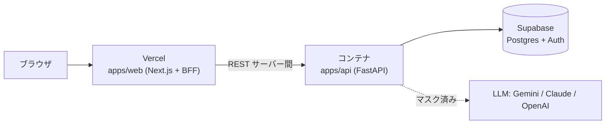

# デプロイガイド

推奨構成: **Web = Vercel / API = コンテナ（Cloud Run or Fly.io）/ DB・Auth = Supabase**。



> データ平面（Protect/Analyze）は常駐コンテナに置きます。DB プール・PII エンジンの
> ウォーム状態・`/analyze/stream` のため、サーバーレスより常駐が適します。

## 1. Supabase（DB / Auth）

1. Supabase プロジェクトを作成。
2. マイグレーション + seed を適用（Supabase では `auth` スキーマは既存なのでシム不要）:
   ```bash
   psql "$DATABASE_URL" -f infra/supabase/migrations/0001_init.sql
   psql "$DATABASE_URL" -f infra/supabase/migrations/0002_rls.sql
   psql "$DATABASE_URL" -f infra/supabase/seed.sql
   ```
3. 控えておく値: `SUPABASE_URL` / `anon key` / **JWT secret**（HS256）/ DB 接続文字列。

## 2. API（コンテナ）

イメージは [`apps/api/Dockerfile`](../apps/api/Dockerfile)（build context = `apps/api`）。
`$PORT` を尊重して起動します。

### 必須環境変数（本番）

| 変数 | 値 |
| --- | --- |
| `SECUREAI_ENVIRONMENT` | `production`（`DEV_SEED` は自動で禁止） |
| `SECUREAI_DATABASE_URL` | `postgresql+asyncpg://…`（Supabase の接続文字列） |
| `SECUREAI_SUPABASE_JWT_SECRET` | Supabase の JWT secret（管理 API 認証） |
| `SECUREAI_ENCRYPTION_KEK` | 32文字以上のランダム秘密（Provider キー暗号）。KMS 利用時は `SECUREAI_KMS_PROVIDER` |
| `SECUREAI_CORS_ORIGINS` | Vercel の本番ドメイン（例 `https://app.example.com`） |
| （任意）`SECUREAI_CLAUDE_DEFAULT_MODEL` / `SECUREAI_OPENAI_DEFAULT_MODEL` | 既定モデル |

### Cloud Run

```bash
gcloud run deploy secureai-api \
  --source apps/api \
  --region asia-northeast1 --allow-unauthenticated \
  --set-env-vars SECUREAI_ENVIRONMENT=production,SECUREAI_DEV_SEED=false \
  --set-env-vars SECUREAI_DATABASE_URL=...,SECUREAI_SUPABASE_JWT_SECRET=...,SECUREAI_ENCRYPTION_KEK=...,SECUREAI_CORS_ORIGINS=https://<vercel-app>
```
（秘密は Secret Manager 連携 `--set-secrets` を推奨。）

### Fly.io

[`apps/api/fly.toml`](../apps/api/fly.toml) を使用。
```bash
cd apps/api
fly launch --no-deploy       # アプリ名/リージョン調整
fly secrets set SECUREAI_DATABASE_URL=... SECUREAI_SUPABASE_JWT_SECRET=... \
                SECUREAI_ENCRYPTION_KEK=... SECUREAI_CORS_ORIGINS=https://<vercel-app>
fly deploy
```

デプロイ後、`GET https://<api-host>/v1/health` が `200` を返すこと。

## 3. Web（Vercel）

1. リポジトリを Vercel にインポートし、**Root Directory = `apps/web`**。
   （npm workspaces のためルートの lockfile から解決されます。）
2. Framework は Next.js（[`apps/web/vercel.json`](../apps/web/vercel.json)）。
3. 環境変数:

| 変数 | 用途 |
| --- | --- |
| `NEXT_PUBLIC_SUPABASE_URL` / `NEXT_PUBLIC_SUPABASE_ANON_KEY` | ブラウザの Supabase Auth |
| `SECUREAI_API_BASE_URL` | デプロイ済み API の URL（サーバー側のみ） |
| `SECUREAI_PROTECT_KEY` / `SECUREAI_ANALYZE_KEY` | Playground BFF 用（サーバー側のみ） |

> 本番の管理 BFF は `SECUREAI_DEV_JWT` を使わず、ブラウザの Supabase セッション JWT を
> Authorization ヘッダで転送します（[`apps/web/src/app/api/mgmt/[...path]/route.ts`](../apps/web/src/app/api/mgmt/%5B...path%5D/route.ts)）。

## 4. セキュリティ・チェックリスト

- [ ] `SECUREAI_DEV_SEED=false`（本番）。`ENVIRONMENT=production` なら起動時に強制チェック。
- [ ] `SECUREAI_ENCRYPTION_KEK` は本番用のランダム値（dev 既定を使わない）。可能なら KMS。
- [ ] `SECUREAI_CORS_ORIGINS` を本番ドメインに限定。
- [ ] 秘密はプラットフォームの Secret 管理（リポジトリにコミットしない）。
- [ ] API は HTTPS のみ（Cloud Run/Fly は既定で TLS）。

## 5. ローカル（Docker Compose）

Postgres + マイグレーション + API を一括起動（Web は `npm run dev` で別途）:
```bash
docker compose -f infra/docker/docker-compose.yml up --build
# API: http://localhost:8000  /  DB: localhost:5432
```
