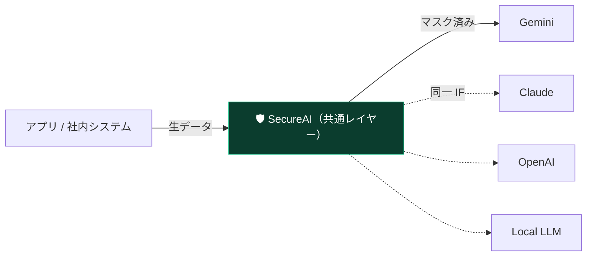

# SecureAI Studio — PRD（プロダクト要求仕様）

> ステータス: 設計フェーズ（承認待ち） / 本書は [README](../README.md) と [設計ドキュメント](./architecture/README.md) と一貫させる基準文書。

## 0. 一行で言うと

**「AI へ送る前に、必ず SecureAI を通す」** — あらゆる AI 利用の前段に置く、共通の PII 保護レイヤー。

## 1. プロダクト・ポジショニング（最重要）

SecureAI Studio は **AI Security Platform** である。

- ❌ 本プロダクトは「Gemini を提供するサービス」では **ない**。
- ✅ 本プロダクトは「**AI へデータを送る前に PII を保護する共通レイヤー**」である。

Gemini はあくまで **最初に対応する 1 プロバイダー** に過ぎない。
中核価値は「どの AI を使っても、送信前に個人情報を守れる横断的な安全層」であること。
この思想を [Architecture](./architecture/01-system-architecture.md)・[README](../README.md)・本 PRD の全てに反映する。

## 2. 解決する課題

- 開発者が LLM に業務データを送る際、氏名・連絡先・番号類などの **PII がそのまま外部送信** されるリスク。
- プロバイダー毎に対策を作り込むのは非効率で、抜け漏れ・二重実装が起きる。
- 「どれだけ保護できるか」を導入前に **検証・説明** する手段がない。

## 3. ターゲットユーザー

| セグメント | 状況 | 主な利用パターン |
| --- | --- | --- |
| AI 導入済み開発者 | すでに Gemini 等を利用 | **Pattern A（Protect API）** |
| AI 未導入開発者 | これから AI を使いたい | **Pattern B（Analyze API）** |
| 情報システム / セキュリティ部門 | 全社的な AI 利用ガバナンス | Studio による集中管理・Analytics・Logs |

## 4. 提供価値と 2 つの利用パターン

- **Pattern A — Protect API**: `App → Protect API → PII 匿名化 → マスク済み返却 → Gemini API`
- **Pattern B — Analyze API**: `App → Analyze API → PII 匿名化 → 登録済み Gemini API → 分析結果`

詳細フローは [README](../README.md#2-つの利用パターン) と [Architecture §4](./architecture/01-system-architecture.md)。

## 5. 主要機能（プロダクト観点）

1. **Studio（管理コンソール）** — Project / Provider / Provider API Keys / Protect Rules / API Keys / Analytics / Logs / Settings。
2. **Protect API / Analyze API** — 中核ランタイム。フェイルクローズ。
3. **Protect Rules（DB 管理）** — 既定 PII に加え、企業独自ルール・Regex を自由追加。
4. **Provider Interface** — Gemini 初期対応、Claude/OpenAI/DeepSeek/Grok/Local を拡張。
5. **API Key 分離** — Project 毎に Protect 用 / Analyze 用を分離、ローテーション可能。
6. **Analytics** — 利用数・Protect 件数・種別内訳・Token 数・Provider 利用率・応答時間。
7. **Protect Playground** — 導入前に保護効果をリアルタイム検証できるデモ画面（差別化）。
8. **SDK** — JS / Python / Node。REST を薄くラップ。
9. **Export Module** — Claude Code / Codex / Cursor / Windsurf 向けプロンプト自動生成。
10. **Plugin 構造** — MCP・Webhook・Streaming・Batch・PDF/Word/Excel・OCR・Image・Audio・RAG を後付け。

## 6. 差別化ポイント

| # | 差別化 | なぜ効くか |
| --- | --- | --- |
| 1 | **プロバイダー非依存の共通レイヤー** | ベンダーロックインを避け、全社標準になれる |
| 2 | **Protect Playground** | 「どれだけ守れるか」を導入前に体感 → 営業・PoC が加速 |
| 3 | **DB 管理のカスタムルール** | 企業固有の PII（社員番号・案件コード等）に対応 |
| 4 | **Export / Plugin / SDK** | 既存の開発ワークフローへ自然に組み込める |
| 5 | **セキュリティ設計（非永続化・KMS 対応暗号）** | セキュリティ製品としての信頼 |

## 7. スコープ

- **MVP**: [MVP 定義](./architecture/08-mvp.md) を参照（Gemini 単独 + Protect/Analyze + Studio 主要画面 + Protect Playground）。
- **段階拡張**: [ロードマップ](./architecture/07-roadmap.md)（マルチプロバイダー・SDK・Export・Plugin・Analytics 強化）。

## 8. 非目標（Non-Goals）

- 独自 LLM の開発・提供は行わない。
- LLM の推論品質そのものの向上は目的としない（保護レイヤーに徹する）。
- MVP 時点でのマルチプロバイダー同時対応・課金・SSO は対象外（後続フェーズ）。

## 9. 成功指標（KPI）

- Time to First Protected Request（統合完了まで）: 15 分以内。
- 主要 PII の検出再現率: 95%+（社内コーパス）。
- Protect API p95 レイテンシ: < 300ms。
- 重大な PII 漏洩インシデント: 0 件。
- Playground 実行 → 導入検討転換率（営業指標）。

## 10. 原則（設計に落ちる価値観）

1. **データ最小化** — 生 PII は永続化しない。
2. **フェイルクローズ** — 匿名化に失敗したら AI へ送らない。
3. **拡張性優先** — Provider / Rule / Plugin / Export はすべて後から追加できる。
4. **開発者体験** — 数行で導入、SDK・Export で摩擦ゼロ。
