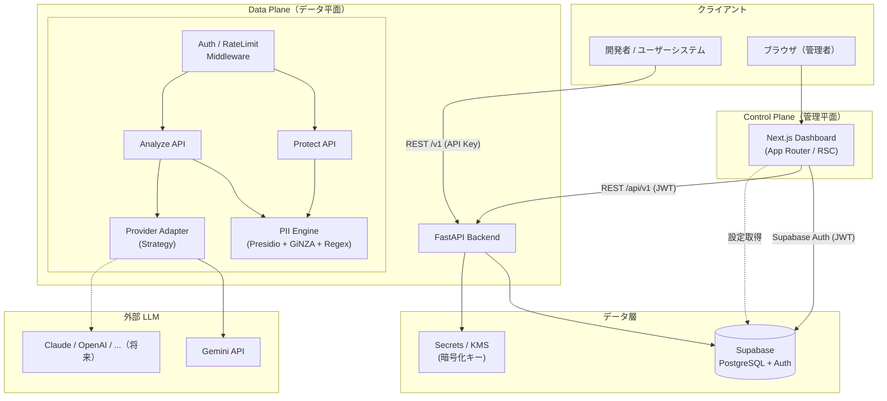
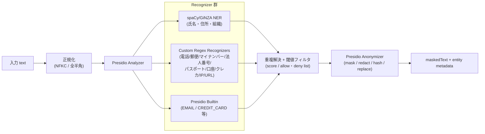
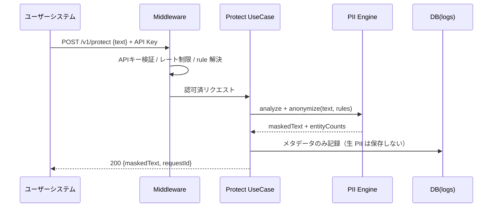
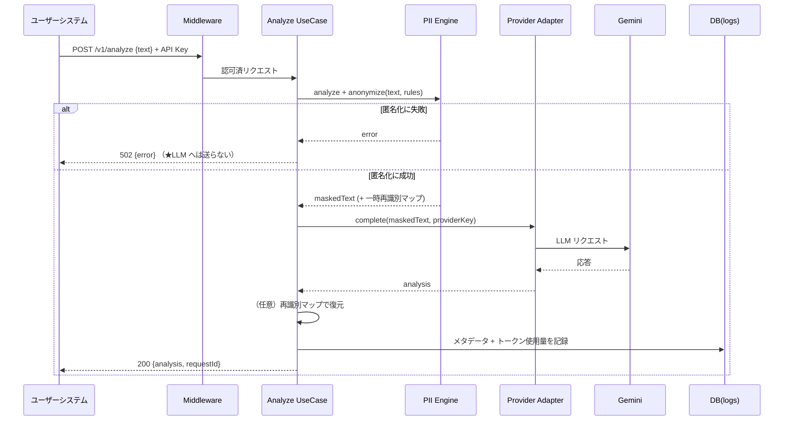

# ① システムアーキテクチャ

## 1. 全体像

SecureAI Studio は、責務の異なる **2 つの平面（Plane）** で構成します。
これにより、管理機能とリクエスト処理を独立してスケール・デプロイでき、
セキュリティ境界も明確になります。

- **Control Plane（管理平面）** — Studio ダッシュボード。プロジェクト / プロバイダー / キー / ルールの管理、ログ・分析の閲覧。
- **Data Plane（データ平面）** — Protect / Analyze API。実際に PII 検出・匿名化を行うランタイム経路。低レイテンシ・高スループットが要求される。

## 2. 主要コンポーネント

| コンポーネント | 責務 | 技術 |
| --- | --- | --- |
| **Web Dashboard** | 管理 UI。RSC でデータ取得、Client Component で対話。 | Next.js / shadcn/ui |
| **API Gateway (Middleware)** | 認証（JWT / API Key）、レート制限、リクエスト ID 付与、ロギング。 | FastAPI Middleware |
| **Protect API** | text を受け取り、PII を検出・匿名化して `maskedText` を返す。 | FastAPI |
| **Analyze API** | マスク後、登録済みプロバイダーへ送信し `analysis` を返す。 | FastAPI |
| **PII Engine** | 検出・匿名化の中核。多言語 NER + 日本語 NER + Regex。 | Presidio / GiNZA / Regex |
| **Provider Adapter** | LLM プロバイダー差異を吸収する抽象化層（Strategy Pattern）。 | Python |
| **Supabase** | データ永続化・認証・RLS。 | PostgreSQL |
| **Secrets/KMS** | プロバイダーキー等の暗号化。 | AES-256-GCM + KEK |

## 3. PII Engine の内部構成

Presidio を核に、日本語対応と JP 固有 PII のために GiNZA と Regex を組み合わせます。

- **Recognizer レジストリ** は Protect Rule（プロジェクト設定）で ON/OFF・スコア閾値を切り替え。
- **重複解決** — 複数 Recognizer が同一スパンを検出した場合、優先度・スコアで一意化。
- **クレジットカード** は Luhn チェック、**マイナンバー/法人番号** はチェックディジット検証で誤検出を抑制。

## 4. リクエストフロー

### 4.1 Protect API

### 4.2 Analyze API（フェイルクローズが重要）

## 5. 重要な設計判断

### 5.1 生 PII を永続化しない
Data Plane は PII を **通過させるだけ** で、DB には保存しません。
ログには「検出したエンティティ種別と件数」等のメタデータのみを記録します
（[セキュリティ設計](./09-security-design.md) 参照）。

### 5.2 匿名化のトークン戦略
- **既定: 不可逆プレースホルダ** — `<PERSON_1>`, `<EMAIL_2>` のように種別 + 連番。
- **可逆化（フェーズ2）** — Analyze で応答に実データを戻したい場合のため、
  リクエスト処理中のみ有効な **一時マップ** を保持（メモリ内、永続化なし）。
  恒久的な可逆化が必要なら、別途トークン Vault を導入（`D-2`）。

### 5.3 Provider Adapter による拡張
LLM プロバイダーは `ProviderAdapter` インターフェース（port）で抽象化し、
Gemini 実装から着手。Claude / OpenAI / DeepSeek / Grok / Local は同一 IF で追加します。
これは [SOLID の OCP] と [Strategy Pattern] に基づきます。

### 5.4 Control Plane と Data Plane の分離
両者は同一 FastAPI アプリ内のルーター分割で開始し（MVP）、
負荷特性が乖離したらデプロイ単位を分割できるようコード境界を明確化します。

## 6. 非機能要件（目標値・初期）

| 項目 | 目標 |
| --- | --- |
| Protect API レイテンシ | p95 < 300ms（数 KB のテキスト） |
| 可用性 | 99.9%（データ平面） |
| データ保持 | 生 PII: 0（永続化しない） / ログメタデータ: 既定 90 日 |
| スケール | ステートレス水平スケール（PII Engine はワーカープール） |
