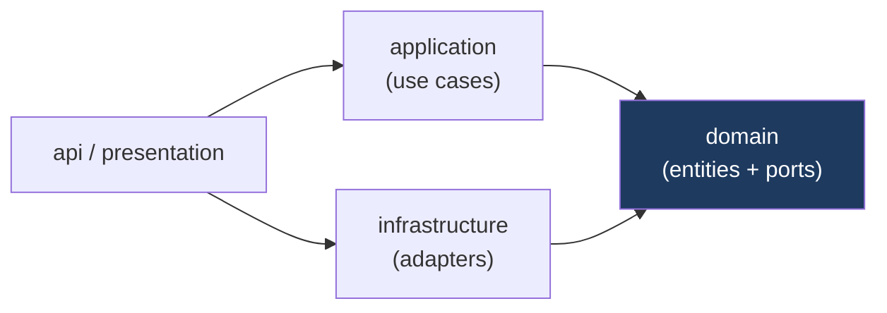

# ② ディレクトリ構成

## 方針

- **モノレポ** — Web / API / 共有型 / インフラを 1 リポジトリで管理（pnpm workspaces + Turborepo）。
- **Web = Feature First** — 機能単位でディレクトリを凝集させ、横断的な `components/ui` は共有。
- **API = Clean Architecture** — `domain` → `application` → `infrastructure` → `presentation` の依存方向を厳守（依存は内側へのみ）。
- **ハードコード禁止** — 定数・設定は `config` と環境変数に集約。

## トップレベル

```text
secureai-studio/
├── apps/
│   ├── web/                     # Next.js ダッシュボード（Control Plane UI）
│   └── api/                     # FastAPI バックエンド（Control + Data Plane）
├── packages/
│   ├── api-types/               # OpenAPI から生成した TS 型（Web が参照）
│   └── config/                  # 共有 lint/tsconfig プリセット
├── infra/
│   ├── supabase/
│   │   ├── migrations/          # SQL マイグレーション（Supabase CLI）
│   │   └── seed.sql             # 初期データ（PII エンティティカタログ等）
│   └── docker/                  # Dockerfile / compose
├── docs/
│   └── architecture/            # 本設計ドキュメント
├── .github/workflows/           # CI（lint / test / build / migration check）
├── .env.example                 # 環境変数テンプレート（値は含めない）
├── turbo.json
├── pnpm-workspace.yaml
└── README.md
```

## Web（`apps/web/`）— Feature First × App Router

```text
apps/web/src/
├── app/                          # App Router（ルーティングのみ薄く）
│   ├── (auth)/                   #   認証系レイアウト
│   │   ├── sign-in/page.tsx
│   │   ├── sign-up/page.tsx
│   │   └── reset-password/page.tsx
│   ├── (dashboard)/              #   認証必須レイアウト（サイドバー付）
│   │   ├── layout.tsx
│   │   ├── dashboard/page.tsx
│   │   ├── projects/…            #   一覧・詳細
│   │   ├── providers/…
│   │   ├── api-keys/…
│   │   ├── protect-rules/…
│   │   ├── analytics/…
│   │   ├── logs/…
│   │   ├── playground/…          #   PII マスクを試すテスト画面
│   │   └── settings/…
│   └── layout.tsx                #   ルートレイアウト（Providers/Theme）
├── features/                     # ★ 機能単位モジュール（Feature First）
│   ├── projects/
│   │   ├── api/                  #     RQ hooks（fetch/mutation）
│   │   ├── components/           #     機能専用 UI
│   │   ├── hooks/
│   │   ├── schemas/              #     zod スキーマ
│   │   └── types.ts
│   ├── providers/
│   ├── api-keys/
│   ├── protect-rules/
│   ├── analytics/
│   └── logs/
├── components/
│   ├── ui/                       # shadcn/ui 生成物（Button, Table, Dialog…）
│   └── layout/                   # AppSidebar, Topbar, ProjectSwitcher
├── lib/
│   ├── supabase/                 # client / server / middleware clients
│   ├── api-client.ts             # 型付き REST クライアント（api-types 使用）
│   ├── query-client.ts           # TanStack Query 設定
│   └── utils.ts                  # cn() 等
├── hooks/                        # 横断 hooks（useUser 等）
├── config/                       # env 読み込み（zod 検証）/ 定数 / ナビ定義
├── types/                        # グローバル型
└── styles/                       # globals.css（Tailwind）
```

**依存ルール**: `app/` はできるだけ薄く、ロジックは `features/*` に集約。
`features/*` 間の直接依存は避け、共有は `components/`・`lib/`・`hooks/` を経由。

## API（`apps/api/`）— Clean Architecture

```text
apps/api/src/
├── main.py                       # アプリ生成 / ルーター登録 / lifespan
├── core/                         # 横断関心事
│   ├── config.py                 #   pydantic-settings（環境変数）
│   ├── security.py               #   JWT 検証 / API キー検証 / 暗号化
│   ├── logging.py                #   structlog 設定（構造化ログ統一）
│   ├── errors.py                 #   例外階層 + 統一エラーハンドラ
│   └── middleware.py             #   request_id / ratelimit / timing
├── domain/                       # ★ 最内層（フレームワーク非依存）
│   ├── entities/                 #   Project, Provider, ApiKey, ProtectRule…
│   ├── value_objects/            #   MaskedText, EntityType, PiiSpan…
│   ├── services/                 #   純粋ドメインロジック（重複解決など）
│   └── ports/                    #   ★ インターフェース（Repository / PiiEngine / ProviderAdapter）
├── application/                  # ユースケース（オーケストレーション）
│   ├── protect/
│   │   └── protect_text.py       #   ProtectTextUseCase
│   ├── analyze/
│   │   └── analyze_text.py
│   └── management/               #   projects / providers / keys / rules の CRUD ユースケース
├── infrastructure/               # 外部世界のアダプタ（ports の実装）
│   ├── db/
│   │   ├── models.py             #   SQLAlchemy モデル
│   │   ├── session.py
│   │   └── repositories/         #   *RepositoryImpl（Repository Pattern）
│   ├── pii/
│   │   ├── presidio_engine.py    #   PiiEngine 実装
│   │   └── recognizers/          #   JP 固有 Regex Recognizer
│   ├── providers/
│   │   ├── base.py               #   ProviderAdapter 基底
│   │   └── gemini_adapter.py     #   （将来: claude_adapter.py 等）
│   └── crypto/                   #   AES-GCM エンベロープ暗号
├── api/                          # プレゼンテーション層（HTTP）
│   ├── deps.py                   #   DI（current_user / current_project / uow）
│   └── v1/
│       ├── routers/
│       │   ├── protect.py        #   Data Plane
│       │   ├── analyze.py        #   Data Plane
│       │   ├── projects.py       #   Control Plane
│       │   ├── providers.py
│       │   ├── api_keys.py
│       │   ├── protect_rules.py
│       │   ├── logs.py
│       │   └── analytics.py
│       └── schemas/              #   Pydantic DTO（Request/Response）
└── tests/                        # pytest（unit / integration）
```

### 依存方向（Clean Architecture）



- `domain` はどこにも依存しない（フレームワーク・DB・HTTP を知らない）。
- `application` は `domain.ports` の **インターフェース** にのみ依存。
- `infrastructure` が `ports` を **実装** し、DI（`api/deps.py`）で注入。
- これにより PII エンジンやプロバイダーの差し替え、テスト時のモック化が容易。

## 命名・規約

- Web: ファイル `kebab-case`、コンポーネント `PascalCase`、hooks `useXxx`。
- API: モジュール/関数 `snake_case`、クラス `PascalCase`。
- どちらも Strict 型（TS `strict: true` / Python `mypy --strict` を目標）。
