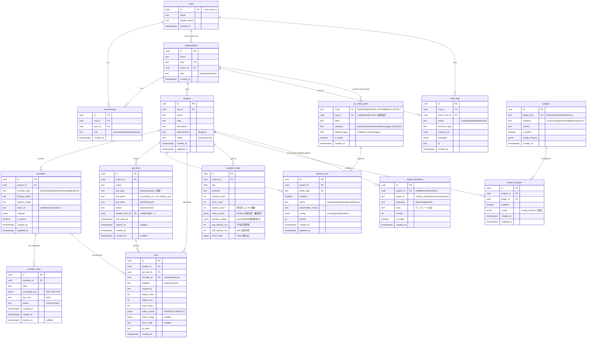

# ③ DB 設計

- DBMS: **PostgreSQL（Supabase）**
- 認証: **Supabase Auth**（`auth.users` が真の認証テーブル）
- 分離: **Row Level Security (RLS)** による組織/プロジェクト単位のテナント分離
- 主キー: `uuid`（`gen_random_uuid()`）、時刻: `timestamptz`
- 命名: テーブル・カラムは `snake_case`、単数外部キーは `xxx_id`

## 1. ER 図



## 2. テーブル定義（要点）

### `users`
Supabase の `auth.users` を真とし、公開スキーマにプロフィールを持つミラー。
`id` は `auth.users(id)` への FK。サインアップ時にトリガーで自動生成。

### `organizations` / `memberships`
テナント境界（`D-1` 推奨: 最初から導入）。`memberships.role` で RBAC。
MVP では「サインアップ時に個人用 org を自動作成」し、UI 上は意識させない運用も可能。

### `projects`
テナント内の作業単位。`environment` で dev/prod を区別。APIキー・ルールはここに紐づく。

### `providers` / `provider_keys`
- `providers` = プロジェクト内に登録した LLM プロバイダー実体（例: 「本番 Gemini」）。
- `provider_keys` = そのプロバイダーの API キー。**暗号化して保存**、`key_hint` に末尾4桁のみ平文。
  複数キー + `status` によりローテーション対応。**復号は Data Plane 実行時のみ**。

### `api_keys`（⑧ Protect / Analyze を分離・ローテーション）
SecureAI が発行する呼び出し用キー。**Project 毎に `key_type` で Protect 用 / Analyze 用を分離**する
（1 キー = いずれか一方の用途）。プレフィックスも `sk_protect_` / `sk_analyze_` で区別。
- **生キーは保存せず** `key_hash` のみ保存。作成時に一度だけ平文を返す（`key_prefix` は識別・表示用）。
- **ローテーション**: 新キーを発行し、`rotated_from_id` で旧キーを参照。旧キーは猶予期間後に
  `revoked` へ。無停止でのキー切替が可能。
- Data Plane はリクエストの用途（protect/analyze）と `key_type` の一致を検証（不一致は `403`）。

### `pii_entity_types`（カタログ）+ `protect_rules`（⑤ 完全 DB 管理・拡張可能）
Protect Rule は **固定 12 項目ではなく DB 管理**とし、以下を後から自由に追加できる:
- **独自ルール** — `pii_entity_types` に新コードを追加（`is_builtin=false`）。
- **Regex 追加** — `default_regex`／`protect_rules.config.regex` にパターンを定義。
- **企業独自ルール** — `pii_entity_types.org_id` を設定し **組織スコープ**で管理（例: 社員番号・案件コード）。
  RLS により他組織からは不可視。

構成:
- 既定 12 種を `pii_entity_types`（`org_id=null, is_builtin=true`）にシード（下表）。
- `protect_rules` はプロジェクト × エンティティで 1 行（`UNIQUE(project_id, entity_type)`）。
  `enabled` で ON/OFF、`action` で匿名化方法、`config` に閾値・Regex・許可/拒否リスト、`priority` で重複解決順。
- 検出エンジンは有効な `protect_rules` を読み、組込 Recognizer と **カスタム Regex Recognizer** を動的に構成
  （[PII Engine](./01-system-architecture.md#3-pii-engine-の内部構成)）。コード変更なしにルールを拡張できる。

#### 既定エンティティ（シード）

| code | label | category |
| --- | --- | --- |
| `PERSON` | 氏名 | identity |
| `PHONE_NUMBER` | 電話番号 | contact |
| `EMAIL_ADDRESS` | メール | contact |
| `LOCATION` | 住所 | identity |
| `JP_POSTAL_CODE` | 郵便番号 | contact |
| `URL` | URL | network |
| `IP_ADDRESS` | IP | network |
| `JP_BANK_ACCOUNT` | 銀行口座 | financial |
| `CREDIT_CARD` | クレジットカード | financial |
| `JP_MYNUMBER` | マイナンバー | gov_id |
| `JP_PASSPORT` | パスポート | gov_id |
| `JP_CORPORATE_NUMBER` | 法人番号 | gov_id |

### `logs`
Data Plane の 1 リクエスト = 1 行。**生テキスト・生 PII は保存しない**。
`entity_counts` に「種別ごとの件数」、`ip_hash` は生 IP をハッシュ化。

### `analytics_daily`（⑨ 集計指標の拡張）
`logs` からの日次ロールアップ（バッチ or トリガー）。ダッシュボードの時系列表示用。
リアルタイム値は `logs` を集計、履歴はこのテーブルで高速化。集計する指標:
- **API 利用数** (`request_count`, `error_count`)
- **Protect 件数** (`protect_count`) と **Protect 対象内訳** (`entity_counts` = 種別別)
- **Token 数** (`token_total`)
- **Provider 利用率** (`provider_usage` = provider 別回数/割合)
- **レスポンス時間** (`avg_latency_ms`, `p95_latency_ms`)

### `plugins` / `project_plugins`（⑪ Plugin 構造）
- `plugins` = 利用可能な Plugin カタログ（extractor/augmentation/delivery/protocol）。`config_schema` で設定検証。
- `project_plugins` = プロジェクト単位の有効化と設定（[Plugin Architecture](./14-plugin-architecture.md)）。

### `export_templates`（⑦ Export Module）
Claude Code / Codex / Cursor / Windsurf 向けプロンプトのテンプレート。
`project_id=null` は組込グローバル、値ありは企業独自（[Export Module](./13-export-module.md)）。**実キーは保存しない**。

### `audit_logs`
Control Plane の重要操作（キー発行・失効・ローテーション・ルール変更・キー閲覧）を記録。改ざん検知・監査用。

## 3. RLS（Row Level Security）方針

全テナントテーブルで RLS を **有効化**。基本ポリシー:

```sql
-- 例: projects は所属 org のメンバーのみ参照可
create policy "member can read projects"
on public.projects for select
using (
  org_id in (
    select org_id from public.memberships
    where user_id = auth.uid()
  )
);
```

- 参照系（Dashboard）は **RLS + JWT(`auth.uid()`)** で自動的にテナント分離。
- 書き込み（Data Plane のログ等）は **service_role** を使用し、アプリ層で
  `project_id` の所有を検証してから挿入（RLS はバイパスされるため二重チェック）。
- `provider_keys`・`api_keys.key_hash` など機微列は、RLS に加え **アプリ層でのみ復号/検証**。

## 4. インデックス（主要）

| テーブル | インデックス |
| --- | --- |
| `logs` | `(project_id, created_at desc)`, `(api_key_id)`, `(endpoint)` |
| `memberships` | `(user_id)`, `unique(org_id, user_id)` |
| `api_keys` | `unique(key_hash)`, `(project_id, key_type, status)` |
| `protect_rules` | `unique(project_id, entity_type)` |
| `pii_entity_types` | `(org_id)`, `unique(org_id, code)` |
| `project_plugins` | `unique(project_id, plugin_id)` |
| `export_templates` | `(project_id, target_id, language)` |
| `analytics_daily` | `unique(project_id, day, endpoint)` |

## 5. マイグレーション方針

- **Supabase CLI** でスキーマ管理（`infra/supabase/migrations/`）。
- バックエンドの SQLAlchemy モデルは同スキーマに追従（`D-4` 採用時は Alembic と役割分担: DDL は Supabase 側を正とする）。
- `seed.sql` で `pii_entity_types` の既定 12 種と `plugins` カタログ・`export_templates` の
  組込テンプレートを投入。
- 破壊的変更は避け、後方互換のカラム追加を優先（拡張性）。
- カスタム PII 種別・Plugin・Export テンプレートは **DDL 変更不要**（データとして追加）で拡張できる。
