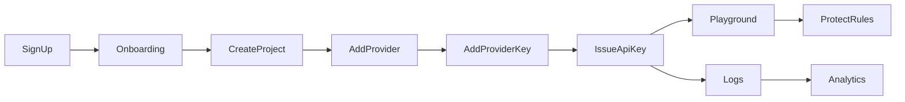

# ⑤ 画面一覧

Google AI Studio に倣い、**左サイドバー + プロジェクトスイッチャー + メインコンテンツ** の構成。
すべての `(dashboard)` 配下は認証必須。

## 認証系（`(auth)`）

| 画面 | ルート | 目的 | 主要アクション |
| --- | --- | --- | --- |
| Sign In | `/sign-in` | ログイン | Email/Password・OAuth（将来） |
| Sign Up | `/sign-up` | ユーザー登録 | 登録 → org 自動作成 → オンボーディング |
| Reset Password | `/reset-password` | パスワード再設定 | 再設定メール送信 |

## ダッシュボード系（`(dashboard)`）

| 画面 | ルート | 目的 | 主要アクション |
| --- | --- | --- | --- |
| **Dashboard** | `/dashboard` | 概況。主要 KPI・最近のアクティビティ・クイックスタート。 | プロジェクト作成へ誘導 |
| **Projects** | `/projects` | プロジェクト一覧。 | 新規作成・検索・アーカイブ |
| Project Detail | `/projects/[id]` | 単一プロジェクトの概要（キー数・ルール状況・直近ログ）。 | 各設定へ遷移 |
| **Providers** | `/providers` | 登録済み AI プロバイダー一覧。 | プロバイダー登録・有効/無効 |
| Provider Detail | `/providers/[id]` | プロバイダー設定 + **Provider API Keys** 管理（暗号化・末尾4桁のみ表示）。 | キー登録・ローテーション・失効 |
| **API Keys** | `/api-keys` | SecureAI 発行キー。**Protect / Analyze をタブで分離**。 | 用途別に発行（1回だけ表示）・ローテーション・失効 |
| **Protect Rules** | `/protect-rules` | PII ルールの ON/OFF・匿名化方法（**DB 管理**）。 | トグル・action 変更・**カスタム/Regex 追加** |
| **Protect Playground** | `/playground` | 貼付 → ルール ON/OFF → 保護実行 → 置換をリアルタイムプレビュー → Gemini で分析。 | 検出/マスク実行・cURL/SDK 出力・デモ（[設計](./15-protect-playground.md)） |
| **Export** | `/export` | Claude Code / Codex / Cursor / Windsurf 向けプロンプト生成。 | ターゲット選択・言語選択・コピー（[設計](./13-export-module.md)） |
| **Analytics** | `/analytics` | 利用数・**Protect 件数・種別内訳・Token・Provider 利用率・応答時間**。 | 期間フィルタ・エクスポート |
| **Logs** | `/logs` | リクエストログ（メタデータのみ）。 | フィルタ・詳細表示・requestId 検索 |
| Log Detail | `/logs/[id]` | 単一リクエストの詳細（種別件数・レイテンシ・ステータス）。 | 再現情報コピー |
| **Settings** | `/settings` | プロフィール・組織・メンバー・プラン・危険操作。 | メンバー招待・org 設定・退会 |

## 補助

| 画面 | ルート | 目的 |
| --- | --- | --- |
| Onboarding | `/onboarding` | 初回導線（プロジェクト作成 → プロバイダー登録 → キー発行 → Playground） |
| Not Found / Error | `/not-found`, `error.tsx` | 統一エラー画面 |

## 情報設計（サイドバー・ナビ）

```text
[Project ▾]  ← プロジェクトスイッチャー（上部）
─────────────
  Dashboard
  Projects
  Providers
  API Keys        (Protect / Analyze)
  Protect Rules
  Protect Playground
  Export
─────────────
  Analytics
  Logs
─────────────
  Settings
[User ▾]     ← 下部（プロフィール/ログアウト）
```

- **プロジェクトスコープ**（Providers / API Keys / Protect Rules / Logs / Analytics / Playground）は
  選択中プロジェクトに追従。
- **アカウントスコープ**（Projects / Settings）はプロジェクト非依存。

## 画面遷移（主要導線）


