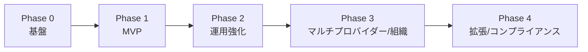

# ⑦ 開発ロードマップ

段階的にリリース可能な価値を積み上げます。各フェーズは **完了条件（Exit Criteria）** を満たしたら次へ。

## Phase 0 — 基盤（Foundation）
モノレポ・CI・環境・認証・スキーマの土台。

- pnpm workspaces + Turborepo、`.env.example`、Docker/compose。
- GitHub Actions（lint / typecheck / test / build / migration check）。
- Supabase プロジェクト作成、`migrations` 初版、`seed.sql`（PII カタログ 12 種）。
- Supabase Auth 連携（サインアップ → `users`/`organization` 自動生成トリガー）。
- FastAPI/Next.js の空アプリ + ヘルスチェック + 統一エラー/ログ基盤。

**Exit**: CI 緑・ログイン成功・空ダッシュボード表示・DB マイグレーション適用。

## Phase 1 — MVP（[定義](./08-mvp.md)）
「AI を使う前に SecureAI を通す」最小体験を通しで提供。

- Projects CRUD / Providers（**Provider Interface** 上に Gemini 実装）+ provider_keys（**AES-256-GCM**）。
- **API Keys（Protect / Analyze 分離・ローテーション）**。
- Protect Rules（**DB 管理**・既定 12 種の ON/OFF + action）。
- **Protect API** / **Analyze API（Gemini）** + フェイルクローズ。
- PII Engine（Presidio + GiNZA + JP Regex Recognizers）。
- Logs（メタデータ）+ **Protect Playground**（差別化・導入前検証）。

**Exit**: 発行キーで Protect/Analyze が動作、Playground で検証可、ログ記録、[MVP 受け入れ基準](./08-mvp.md#受け入れ基準)充足。

## Phase 2 — 運用強化（Hardening & Insights）
- Analytics 拡張（**Protect 件数・種別内訳・Token 数・Provider 利用率・応答時間**）+ `analytics_daily` ロールアップ。
- **カスタム/企業独自 Protect ルール（Regex 追加・org スコープ）**。
- API キーの失効/ローテーション運用、レート制限・クォータ、`Idempotency-Key`。
- 監査ログ（audit_logs）、構造化ログ強化、メトリクス/トレース。
- **SDK（`@secureai/sdk`, `secureai`）α版** / **Export Module（Claude Code/Codex/Cursor/Windsurf）**。

**Exit**: 主要指標が可視化、レート制限稼働、監査ログ記録、SDK で 3 行統合。

## Phase 3 — マルチプロバイダー / 組織（Scale）
- Provider Interface を拡張: Claude / OpenAI / DeepSeek / Grok / Local LLM。
- 組織・メンバー・RBAC（owner/admin/member/viewer）、招待フロー。
- **Plugin 基盤（registry / hook / manifest）+ 初期 Plugin（Webhook / Streaming Response）**。
- 可逆トークン化 Vault（永続的な再識別が必要な業務向け）。
- リージョン/データレジデンシ対応の基礎。

**Exit**: 2 つ以上のプロバイダーが同一 IF で動作、チーム利用可、RBAC 施行。

## Phase 4 — 拡張 / コンプライアンス（Enterprise）
- GraphQL エンドポイント（REST と併存、ユースケース共有）。
- **Plugin エコシステム拡充: MCP / Batch Analyze / PDF・Word・Excel / OCR・Image / Audio / RAG**。
- セルフホスト/オンプレ配布、SSO/SAML。
- コンプライアンス（SOC2 / ISO 27001 準備、DPA、APPI/GDPR 対応の証跡）。
- 高度検出（カスタム ML モデル、文脈依存検出）。

**Exit**: エンタープライズ要件（監査・SSO・SLA）を満たす。

## 分野横断で継続する事項
- テスト（unit/integration/e2e）とカバレッジ目標の維持。
- セキュリティ（依存脆弱性・シークレットスキャン・SAST/DAST）を CI で常時実行。
- ドキュメント（API リファレンス・SDK・運用 Runbook）の更新。

> 期間見積りは着手時にスプリント計画で確定します（本書では相対順序と完了条件を定義）。
