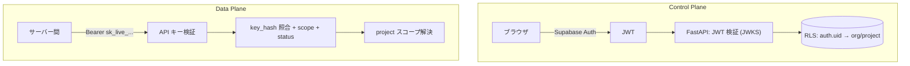

# ⑨ セキュリティ設計

SecureAI Studio は **セキュリティ製品** であり、セキュリティは機能ではなく前提です。
中核となる 3 原則:

1. **データ最小化** — 生の PII は永続化しない。処理は一過性（in-memory）。
2. **フェイルクローズ** — 匿名化に少しでも失敗したら LLM へは絶対に送らない。
3. **最小権限** — テナント分離（RLS）・スコープ付きキー・service_role の限定使用。

## 1. データ保護（PII の取り扱い）

- **非永続化**: Protect/Analyze は PII を通過させるのみ。DB・ログに **生テキスト/生 PII を保存しない**。
- **ログはメタデータのみ**: `entity_counts`（種別と件数）、レイテンシ、ステータス、`ip_hash`。
- **プレビューの扱い**: 万一マスク前後のプレビュー保存を将来オプション化する場合も、
  既定 OFF・暗号化・短命 TTL・厳格なアクセス制御を必須とする。
- **メモリ衛生**: 処理後のバッファは速やかに解放。ログ/例外に text を含めない（`repr` 抑制）。
- **再識別マップ**: Analyze の `deanonymize` 用マップは **リクエスト処理中のみ** メモリ保持、永続化しない。

## 2. 秘密情報の管理

| 対象 | 保存方法 |
| --- | --- |
| **プロバイダー API キー**（Gemini 等） | **AES-256-GCM** で暗号化（エンベロープ暗号）。KEK は KMS/環境変数。`key_hint` に末尾4桁のみ平文。 |
| **SecureAI 発行キー** | 平文を保存しない。**`key_hash`（argon2/sha256）** のみ。作成時に 1 回だけ平文返却。`key_prefix` で識別。 |
| **Supabase service_role / JWT secret** | 環境変数（`.env`／シークレットマネージャ）。**コード/リポジトリに置かない**。 |

- 復号は **Data Plane 実行時のみ**、必要最小限のスコープで。復号値をログに出さない。
- **鍵ローテーション**: KEK/DEK・プロバイダーキー・発行キーすべてローテーション/失効可能に設計。
- **シークレットスキャン**: CI で gitleaks 等を実行し、誤コミットを検知。

## 3. 認証・認可

- **Control Plane**: Supabase Auth の JWT を JWKS で検証 → `auth.uid()` に基づく **RLS** でテナント分離。
- **Data Plane**: API キーは `key_hash` で照合、`scopes`（protect/analyze）・`status`・`expires_at` を検証。
- **RBAC**（Phase 3）: owner/admin/member/viewer。危険操作（キー閲覧・失効）は権限を絞る。
- **service_role の使用**は Data Plane のログ書込等に限定し、アプリ層で `project_id` 所有を二重検証。

## 4. 通信・アプリケーション保護

- **TLS 必須**（HSTS）。プロキシの CA を尊重し、TLS 検証を無効化しない。
- **CORS**: Dashboard オリジンのみ許可。Data Plane はサーバー間前提で厳格化。
- **セキュリティヘッダ**: CSP・`X-Content-Type-Options`・`Referrer-Policy`・`Permissions-Policy`。
- **入力検証**: サイズ上限（既定 100KB）、型検証（Pydantic/zod）、タイムアウト、コンテンツタイプ確認。
- **レート制限 / クォータ**（Phase 2）: プロジェクト×キー単位。ブルートフォース・濫用対策。
- **CSRF**: Dashboard の状態変更は SameSite/トークンで保護（API キー経路は対象外）。
- **OWASP Top 10** を設計・レビュー観点に組込む。

## 5. PII エンジンの健全性（検出品質＝セキュリティ）

- **フェイルクローズ**: Analyze で検出/匿名化が例外・タイムアウトなら **LLM 送信を中止**し `502`。
- **閾値・許可/拒否リスト**: `protect_rules.config` でスコア閾値と allow/deny を制御し誤検出/見逃しを調整。
- **重複解決**: 複数 Recognizer の重なりを優先度/スコアで一意化（過剰マスク/取りこぼし防止）。
- **検証つき検出**: クレカ（Luhn）、マイナンバー/法人番号（チェックディジット）で誤検出低減。
- **回帰テスト**: PII コーパスで再現率/適合率を CI 監視。ルール変更でのデグレを検知。

## 6. マルチテナント分離

- 全テナントテーブルで **RLS 有効化**。参照は `auth.uid()` 起点、書込はアプリ層検証つき service_role。
- API キーは **プロジェクトスコープ**。キーからテナントを解決し越境不可。
- キャッシュ・ログ・メトリクスにも `project_id` を必ず付与し混線を防止。

## 7. 監査・可観測性

- **audit_logs**（Phase 2）: キー発行/失効、ルール変更、キー閲覧等の重要操作を記録（誰が・いつ・何を）。
- **構造化ログ**（structlog）: `request_id`・`project_id`・`endpoint`・`status`・`latency`。**PII は含めない**。
- **メトリクス/トレース**: レイテンシ・エラー率・検出件数。異常検知に活用。

## 8. コンプライアンス

- **APPI（日本 個人情報保護法）/ GDPR** を考慮。データ最小化・目的制限・削除権に対応する設計。
- **データレジデンシ**（Phase 3+）: リージョン選択。
- **DPA / サブプロセッサ**: LLM プロバイダーへの送信は「マスク後データ」であることを明確化。
- **削除・保持**: ログメタデータは既定 90 日で自動削除（設定可）。生 PII は保持しない。

## 9. 脅威モデル（STRIDE 要約）

| 脅威 | 例 | 対策 |
| --- | --- | --- |
| Spoofing | キー詐称 | key_hash 照合・失効・TLS・JWT 検証 |
| Tampering | ルール改ざん | RBAC・audit_logs・RLS |
| Repudiation | 操作否認 | 監査ログ・request_id |
| Information Disclosure | PII/キー漏洩 | 非永続化・暗号化・ログからの PII 除外 |
| Denial of Service | 大量リクエスト | レート制限・サイズ上限・タイムアウト |
| Elevation of Privilege | 越境アクセス | RLS・スコープキー・最小権限 |

### スコープ外/留意点
- **LLM 側のプロンプトインジェクション** はマスクで完全には防げない。将来、入力サニタイズ/ポリシー層を検討。
- **上流 LLM の学習利用**: プロバイダー設定で学習オプトアウトを推奨（送信前にマスク済みである点が緩和策）。

## 10. セキュア開発ライフサイクル

- CI: `依存脆弱性（pip-audit / npm audit）`・`シークレットスキャン`・`SAST（Semgrep 等）`・型/静的解析。
- 依存の最小化・固定（lockfile）。定期更新。
- 変更は PR レビュー必須。セキュリティに関わる変更は本ドキュメントを更新。
- インシデント対応: 鍵失効手順・ログ調査手順を Runbook 化（Phase 2）。
