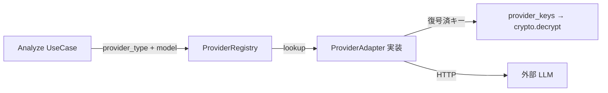

# Provider Interface（LLM プロバイダー抽象化）

> 設計レビュー依頼 **④** に対応。
> 目的: **Gemini 依存を排し**、LLM プロバイダーを差し替え・追加できる構造にする。
> 初期実装は **Gemini**、将来 **Claude / OpenAI / DeepSeek / Grok / Local LLM** を同一 IF で追加。

## 1. 設計原則

- **OCP（開放/閉鎖）** — 新プロバイダー追加時、既存コードを変更せず「実装を足すだけ」。
- **Strategy + Registry** — プロバイダーは `ProviderAdapter` を実装し、`ProviderRegistry` に登録。
- **能力（Capabilities）宣言** — streaming / batch / vision など対応可否をアダプタが宣言。
- **設定は DB 由来** — 使用プロバイダー・モデル・キーは `providers` / `provider_keys`（[DB 設計](./03-database-design.md)）から解決。ハードコードしない。

## 2. Port（インターフェース）

`domain/ports/provider.py`（フレームワーク非依存）。

```python
from typing import AsyncIterator, Protocol

class ProviderAdapter(Protocol):
    provider_type: str                       # "gemini" | "claude" | ...

    def capabilities(self) -> "ProviderCapabilities": ...

    async def complete(self, req: "LlmRequest") -> "LlmResponse": ...

    async def stream(self, req: "LlmRequest") -> AsyncIterator["LlmChunk"]: ...

    async def validate_credential(self, secret: "ProviderSecret") -> bool: ...
```

### 共通 DTO（プロバイダー非依存）

```python
@dataclass(frozen=True)
class LlmRequest:
    prompt: str                    # ★ 既にマスク済みのテキストのみが渡る
    model: str | None = None
    system: str | None = None
    max_tokens: int | None = None
    temperature: float | None = None
    metadata: dict | None = None

@dataclass(frozen=True)
class LlmResponse:
    text: str
    model: str
    usage: "TokenUsage"            # input/output/total → Analytics へ
    raw: dict | None = None        # 生レスポンス（ログには残さない）

@dataclass(frozen=True)
class ProviderCapabilities:
    streaming: bool = False
    batch: bool = False
    vision: bool = False
    json_mode: bool = False
    max_context_tokens: int | None = None
    default_model: str | None = None
```

> **重要**: `ProviderAdapter` に渡る `prompt` は **必ず PII 匿名化済み**。
> Analyze ユースケースが「匿名化 → complete」の順を保証し、匿名化失敗時は呼ばない（フェイルクローズ）。

## 3. Registry と解決フロー



```python
class ProviderRegistry:
    def __init__(self) -> None:
        self._adapters: dict[str, ProviderAdapter] = {}

    def register(self, adapter: ProviderAdapter) -> None:
        self._adapters[adapter.provider_type] = adapter

    def get(self, provider_type: str) -> ProviderAdapter:
        try:
            return self._adapters[provider_type]
        except KeyError:
            raise ProviderNotSupportedError(provider_type)
```

- 起動時に有効なアダプタを `register()`（MVP は Gemini のみ）。
- 追加は `infrastructure/providers/<name>_adapter.py` を作り register するだけ。

## 4. 実装状況・ロードマップ

| provider_type | 状態 | 備考 |
| --- | --- | --- |
| `gemini` | **初期実装（MVP）** | `google-generativeai` / REST |
| `claude` | 将来 | Anthropic API |
| `openai` | 将来 | OpenAI API |
| `deepseek` | 将来 | OpenAI 互換想定 |
| `grok` | 将来 | xAI API |
| `local` | 将来 | `base_url` 指定で OpenAI 互換 / Ollama 等 |

### 能力マトリクス（例・実装時に確定）

| 機能 | gemini | claude | openai | local |
| --- | --- | --- | --- | --- |
| complete | ✅ | ✅ | ✅ | ✅ |
| streaming | ✅ | ✅ | ✅ | 実装依存 |
| batch | 将来 | 将来 | 将来 | 実装依存 |
| vision | ✅ | ✅ | ✅ | 実装依存 |

## 5. エラーとリトライ

- 上流エラーは `ProviderError`（[統一エラー](./04-api-design.md#3-統一エラー形式) の `PROVIDER_ERROR`）へマップ。
- 一時障害は `tenacity` で指数バックオフ・リトライ（冪等な範囲のみ）。
- タイムアウト・レート超過を種別化し、Analytics/Logs に記録（生レスポンスは残さない）。

## 6. DB との対応

- `providers.provider_type` が Registry のキー。`default_model` / `base_url` / `settings` を参照。
- `provider_keys` は暗号化保存。復号は [セキュリティ設計](./09-security-design.md) の `KeyProvider`（KMS 対応）経由で実行時のみ。
