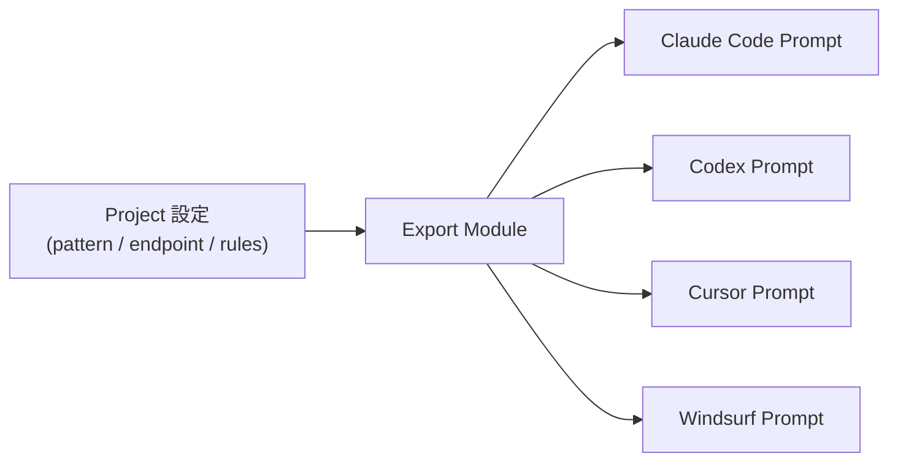

# Export Module（AI コーディングツール向けプロンプト生成）

> 設計レビュー依頼 **⑦** に対応。
> Studio のプロジェクト設定から、以下向けの統合プロンプト/スニペットを **自動生成** する。
> **Claude Code / Codex / Cursor / Windsurf**（将来ターゲット追加可能）。

## 1. 目的とユースケース

開発者が Studio で「Export」を押すと、そのプロジェクトの構成
（利用パターン A/B、エンドポイント、Protect ルール概要、必要な環境変数）を踏まえた
**すぐ貼り付けられるプロンプト** が生成される。AI コーディングツール上で SecureAI 連携コードを即実装できる。



## 2. 設計原則

- **ExportTarget インターフェース + テンプレート** — ターゲットごとにレンダラを実装（Strategy）。追加は実装を足すだけ。
- **秘密情報を埋め込まない（最重要）** — 生成物に実 API キーを **含めない**。必ず環境変数プレースホルダ（例 `${SECUREAI_PROTECT_KEY}`）を用いる。
- **決定的生成** — 同じ入力からは同じ出力（テンプレート + 変数）。
- **多言語対応** — 生成コード片は JS / Python など選択可能（[SDK](./12-sdk-design.md) or REST）。

## 3. インターフェース

```python
class ExportTarget(Protocol):
    target_id: str          # "claude_code" | "codex" | "cursor" | "windsurf"
    label: str

    def render(self, ctx: "ExportContext") -> "ExportArtifact": ...

@dataclass(frozen=True)
class ExportContext:
    pattern: str                     # "protect" | "analyze"
    api_base_url: str
    language: str                    # "typescript" | "python" | ...
    enabled_rules: list[str]         # 種別コードのみ（値は含めない）
    key_env_var: str                 # 例: "SECUREAI_PROTECT_KEY"（値は含めない）
    provider_type: str | None        # analyze の場合

@dataclass(frozen=True)
class ExportArtifact:
    target_id: str
    title: str
    content: str                     # プロンプト本文（Markdown / テキスト）
    format: str                      # "markdown" | "text"
```

- レジストリ `ExportTargetRegistry` に各ターゲットを登録。API から `target_id` で解決。

## 4. テンプレート管理

- **組み込みテンプレート** はコード同梱（バージョン管理）。
- **カスタムテンプレート**（企業独自の書式）は DB 管理: `export_templates`（[DB 設計](./03-database-design.md)）。
  - `id, project_id(nullable=global), target_id, language, body(テンプレート), version, is_builtin`。
- テンプレートエンジンはサンドボックス化（任意コード実行不可・変数展開のみ）。

## 5. API（[管理 API](./04-api-design.md) に追加）

| メソッド | パス | 説明 |
| --- | --- | --- |
| `GET` | `/v1/export/targets` | 利用可能ターゲット一覧 |
| `POST` | `/v1/projects/{id}/export` | `{ targetId, language, pattern }` → `ExportArtifact` |
| `GET/POST` | `/v1/projects/{id}/export/templates` | カスタムテンプレート一覧 / 追加 |

## 6. 生成例（Claude Code 向け・抜粋イメージ）

```text
# タスク: SecureAI Protect を既存コードに統合

あなたは <language> のコードに、LLM へ送信する前段として SecureAI Protect API を
組み込みます。API キーは環境変数 `SECUREAI_PROTECT_KEY` から読み込み、ハードコードしないこと。

- エンドポイント: POST <api_base_url>/v1/protect
- 入力: { "text": "<ユーザー入力>" }
- 出力: { "maskedText": "..." } を取得し、以降の Gemini 呼び出しには maskedText のみを渡す
- 有効な保護種別: PERSON, EMAIL_ADDRESS, PHONE_NUMBER, ...

上記に沿って統合コードと最小テストを生成してください。
```

> 生成物にキーの実値・機微情報は一切含めない。プレースホルダのみ。

## 7. セキュリティ

- 出力物・ログに **実キー / provider_keys を絶対に含めない**（[セキュリティ設計](./09-security-design.md)）。
- テンプレート実行は変数展開に限定（テンプレートインジェクション対策）。
- カスタムテンプレートはプロジェクトスコープ・RLS で分離。
