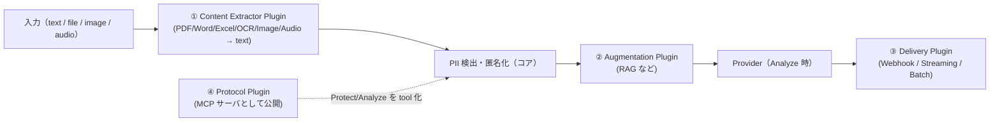

# Plugin Architecture（将来対応を後付け可能にする構造）

> 設計レビュー依頼 **⑪** に対応。
> 以下を **Plugin 構造** で追加できる設計にする（コア変更なしで拡張）:
> **MCP / Webhook / Streaming Response / Batch Analyze / PDF / Word / Excel / OCR / Image / Audio / RAG**。

## 1. 考え方

コアの Protect/Analyze パイプラインを **拡張ポイント（Hook）** で開き、
機能を Plugin として差し込む。プラグインは分類ごとに責務が異なる。



## 2. Plugin 分類

| 分類 | 役割 | 例 |
| --- | --- | --- |
| **Content Extractor** | 非テキスト入力を text 化してコアへ渡す | PDF, Word, Excel, OCR, Image, Audio |
| **Augmentation** | 検出/匿名化の前後で文脈を付加 | RAG（社内ナレッジ付与） |
| **Delivery / Transport** | 結果の受け渡し方式 | Webhook, Streaming Response, Batch Analyze |
| **Protocol** | 外部プロトコルとして機能を公開 | MCP（Protect/Analyze を MCP tool 化） |

> Content Extractor で text 化した後は **必ずコアの PII 匿名化を通す**（フェイルクローズ維持）。

## 3. Plugin コントラクト

```python
class Plugin(Protocol):
    manifest: "PluginManifest"
    def init(self, config: dict, services: "PluginServices") -> None: ...

class ExtractorPlugin(Plugin, Protocol):
    async def extract(self, blob: "InputBlob") -> "ExtractedText": ...

class DeliveryPlugin(Plugin, Protocol):
    async def deliver(self, result: "PipelineResult", target: dict) -> None: ...

@dataclass(frozen=True)
class PluginManifest:
    id: str                         # "pdf-extractor"
    category: str                   # extractor|augmentation|delivery|protocol
    version: str
    capabilities: list[str]
    config_schema: dict             # JSON Schema（設定検証）
```

- **ライフサイクル**: discover → validate(manifest/config) → init → execute → dispose。
- **設定検証**: `config_schema`（JSON Schema）で起動時に検証（フェイルファスト）。
- **隔離**: 外部プロセス/ネットワークを伴う Plugin はタイムアウト・リソース制限・エラー隔離。

## 4. パイプラインの Hook ポイント

| Hook | タイミング | 差し込む分類 |
| --- | --- | --- |
| `on_input` | 入力受領直後 | Extractor（file→text） |
| `pre_detect` | 検出前 | Augmentation（前処理） |
| `post_anonymize` | 匿名化後・LLM 送信前 | Augmentation（RAG 文脈付与） |
| `post_provider` | LLM 応答後 | Delivery（Webhook/Streaming） |
| `expose` | 常時 | Protocol（MCP エンドポイント） |

コアは Hook を呼ぶだけで、個々の Plugin を知らない（依存逆転）。

## 5. レジストリと有効化（プロジェクト単位）

- `PluginRegistry` に組み込み/サードパーティ Plugin を登録。
- **プロジェクト単位で ON/OFF・設定**: DB `plugins`（カタログ）+ `project_plugins`（有効化 + config、[DB 設計](./03-database-design.md)）。
- 課金/権限に応じて利用可否を制御可能。

## 6. 各機能のマッピング（将来）

| 機能 | 分類 | 備考 |
| --- | --- | --- |
| PDF / Word / Excel | Extractor | 文書 → テキスト抽出後に匿名化 |
| OCR / Image | Extractor | 画像 → テキスト（OCR）→ 匿名化（将来: 画像内 PII マスク） |
| Audio | Extractor | 音声 → 文字起こし → 匿名化 |
| RAG | Augmentation | マスク後テキストに社内文脈を付与 |
| Webhook | Delivery | 非同期に結果を通知 |
| Streaming Response | Delivery | 逐次応答（[SDK](./12-sdk-design.md) も対応） |
| Batch Analyze | Delivery/UseCase | 大量テキストの一括処理 |
| MCP | Protocol | Protect/Analyze を MCP tool として公開 |

## 7. セキュリティ上の注意

- Extractor で抽出した中間テキストも **永続化しない**（[セキュリティ設計](./09-security-design.md)）。
- サードパーティ Plugin は最小権限・サンドボックス・監査ログ対象。
- Delivery（Webhook 等）送信前も、送るのは **匿名化済みデータのみ**。
