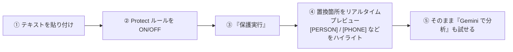

# Protect Playground（導入前検証・デモ画面）

> 設計レビュー依頼の **追加機能**に対応（差別化ポイント）。
> Google AI Studio の Playground のように、**保護効果をその場で体感**できる検証画面。
> 企業が導入前に「どのくらい保護できるか」を試せるため、**営業・PoC・デモ**に効く。

## 1. 体験フロー



1. **貼り付け** — 任意テキストを入力（サンプル投入ボタンあり）。
2. **ルール切替** — 種別ごとに ON/OFF（[Protect Rules](./03-database-design.md) と同じ体系）。
3. **保護実行** — `POST /v1/detect` + `/v1/protect` を呼び、結果取得。
4. **プレビュー** — 元テキストのどこが `[PERSON]`・`[PHONE]` 等に置換されたかを**色分けハイライト**＋対応表で可視化。
5. **分析** — 任意で `POST /v1/analyze` を実行し、マスク済みで LLM 分析まで体験。

## 2. 画面レイアウト（イメージ）

```text
┌ Protect Playground ─────────────────────────────────────────┐
│ [サンプル投入]        Provider:[Gemini ▾]  [保護実行] [分析] │
├───────────────────────────┬─────────────────────────────────┤
│ 入力                      │ 保護後プレビュー                │
│ 田中太郎 090-1234-5678    │ [PERSON] [PHONE]                │
│ taro@example.com          │ [EMAIL]                         │
│                           │                                 │
│ ── 検出結果 ──            │ ── 統計 ──                      │
│ PERSON ● / PHONE ● / ...  │ 検出 3 / マスク率 100%          │
├───────────────────────────┴─────────────────────────────────┤
│ ルール:[●PERSON][●PHONE][●EMAIL][ ADDRESS]...  [cURL/SDK ▾] │
└──────────────────────────────────────────────────────────────┘
```

- 左右分割（入力／保護後）。検出スパンを**ハイライト**し、右にプレースホルダを表示。
- 下部にルールのクイックトグルと、**この結果を再現する cURL / SDK スニペット**（コピー）。
- 「検出件数 / マスク率 / 種別内訳」を統計表示（営業デモで効く数値）。

## 3. 使用 API

| ステップ | エンドポイント |
| --- | --- |
| 検出ハイライト | `POST /v1/detect`（値は返さず種別・位置のみ） |
| マスク結果 | `POST /v1/protect` |
| LLM 分析 | `POST /v1/analyze` |

- ルール切替は**リクエスト単位の一時上書き**（`options.rules`）で表現し、保存済みルールは変更しない。

## 4. セキュリティ / プライバシー

- Playground に貼ったテキストは **永続化しない**（[セキュリティ設計](./09-security-design.md) のデータ最小化に準拠）。
- ログにも生テキスト・生 PII を残さない（メタデータのみ）。
- デモ用途向けに「サンプルデータ」を用意し、実データ投入を促さない導線。

## 5. 位置付け

- **MVP に含める**（[MVP 定義](./08-mvp.md)）。導入判断を後押しする中核体験のため。
- 将来: ルール別の before/after 比較、複数プロバイダーの結果比較（[Provider Interface](./11-provider-interface.md)）、
  ファイル入力（[Plugin](./14-plugin-architecture.md)）に拡張。
